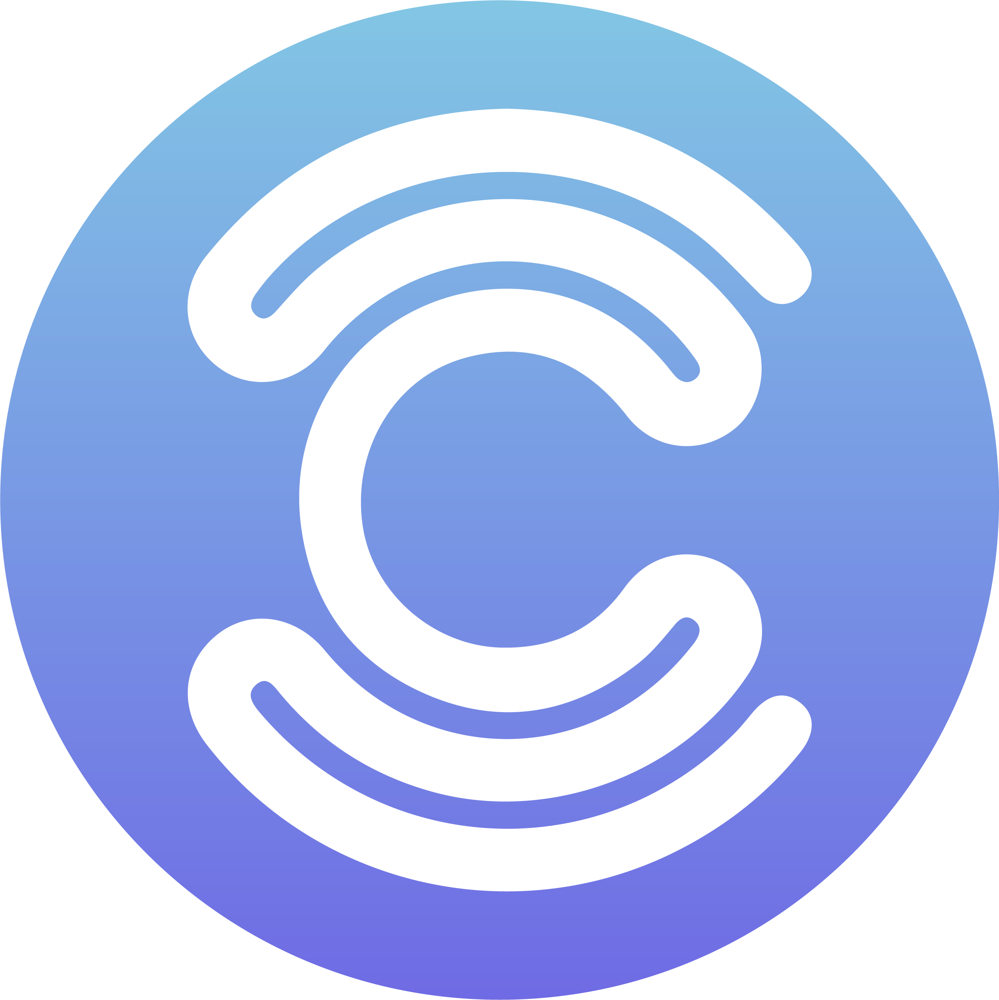

  

# CLINE

CLINE is a web development company focused on creating, maintaining, and improving professional websites for businesses.

The company provides practical digital solutions for businesses that need a stronger online presence, better website reliability, clearer content structure, and ongoing technical support. CLINE works with business websites, WordPress development, website maintenance, SEO support, mobile optimization, troubleshooting, and client-facing digital solutions.

## About CLINE

CLINE helps businesses build and manage professional websites that are clear, functional, and easy to maintain. The company focuses on practical solutions that support real business needs, including new website creation, website updates, redesigns, technical fixes, and long-term website support.

## Services

CLINE provides website services such as:

- Business website development
- WordPress website creation and customization
- Website maintenance and updates
- Website redesigns and improvements
- SEO structure support
- Mobile responsiveness improvements
- Bug fixes and troubleshooting
- Hosting, domain, and website availability support
- Client communication and technical support

## Website Projects

### BLK Swan Security

BLK Swan Security is a business website created and supported through CLINE for a security advisory company. The website presents the company’s security services, including commercial and residential security, executive protection, and risk analysis.

CLINE’s work included the website structure, visual presentation, service sections, contact access, and overall business website implementation.

Website: https://blkswansecurity.com

### Lerones Logistics

Lerones Logistics is a business website project where CLINE worked on the website design and visual structure.

CLINE’s role was focused on the design and presentation of the website. Any current SSL, certificate, hosting, or security configuration issue affecting the website is not CLINE’s responsibility.

Website: https://www.leroneslogistics.com

### YB Events Miami

YB Events Miami is a website created and supported through CLINE for an event design and floral decoration business. The website presents the company’s event services, including wedding florals, floral and event design, social and corporate events, rentals, small catering, and everyday flowers.

CLINE’s work included the website structure, service presentation, gallery layout, contact section, and overall public-facing website implementation.

Website: https://ybeventsmiami.com

### VPI Seguridad

VPI Seguridad is a business website created and supported through CLINE for Venezolana de Protección Integral, C.A., a security company based in Venezuela. The website presents the company’s security services, including commercial and residential security, VIP custody, and risk analysis.

CLINE’s work included the website structure, content presentation, service sections, contact access, business information, and ongoing website support.

Website: https://vpiseguridad.com

## Inactive Website Projects

The following websites were also part of CLINE’s website work, but are currently inactive or not being presented as active live projects:

### Eduardo Roca Vet

Website: https://eduardorocavet.com

### Vilexy Cruz

Website: https://vilexyscruz.com

### Miami Realtor Luisana

Website: https://miamirealtorluisana.com

## Purpose of This Repository

This repository serves as the official project repository for CLINE. It documents the company’s services, website projects, support work, maintenance processes, and digital solutions.

## Privacy Note

This repository does not include private credentials, backend access, client-sensitive files, proprietary business information, or restricted website materials.
